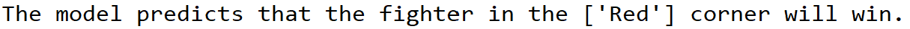
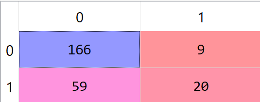

# MMA Winner Predictor - XGboost

Algorithm that predicts who will win a UFC contest between two fighters. The dataset used to train the model contains a vareity of statistics about fights dating back to as far as 1993, along with in-depth stats about each fighter. The statistics relating to each fighter that were used to train the model are as follows: current lose streak, current win streak, total draws, longest win streak, total losses, total draws, total rounds fought, total time fought (seconds), total title bouts, number of wins by decision (majority), number of wins by decision (unanimous), wins by KO/TKO, wins by submission, wins by doctor stoppage, total wins, stance, height (cm), reach (cm), weight (lbs), and age. Once trained, the user can enter statistics about two fighters in question, all of which can be found at [ufcstats.com](http://www.ufcstats.com/fighter-details/f4c49976c75c5ab2), and model will give you its prediction as to who will win the fight. Predictions were made with 63.44% accuracy when predicting the test set values. (NOTE: This prediction algorithm preforms the same overall function as the project titled, 'MMA Winner Predictor Artificial Neural Network.' The differences between the two are that this model was trained using Extreme Gradient Boosting). 

## Getting Started
### Prerequisites
* Python 3.7

### Packages to Install
* pandas - software library for data manipulation and analysis
* numpy - general-purpose array-processing package
* scikit learn - machine learning library
* sklearn_pandas - provides a bridge between scikit-learn's machine learning methods and pandas Data Frames
  
## Running the Program
* First, open the 'Data' folder, download UFCdata.zip, and extract UFCdata.csv (NOTE: there is another file in the folder titled, 'Unedited UFCdata.csv'. This is the original file that was returned when the UFCstats website was scraped using Beautiful Soup. I didn't chose to include all of the information about the contest/fighters that UFCstats.com provided, so I deleted some of the columns, only keeping the ones that I felt were relevant, and saved this new file as 'UFCdata.csv'. Should you desire, you can use 'Unedited UFCdata.csv' to include any other information that I may have deleted about the contest/fighters when I created 'UFCdata.csv')
* Once the data is downloaded, run the entire program
* Once the model has finished training itself, you will be asked if you would you like to have it make a predicition based on user-defined data. If you type 'no', the program will end. If you type 'yes', you will be prompted to enter a variety of information about each fighter in question. The program doesn't categorize fighters by name, it simply labels them as the red corner fighter and the blue corner fighter. If you are attempting to predict an upcoming UFC fight, then UFCstats.com will tell you which fighter is fighting out of the blue corner, and which is fighting out of the red. If this isn't a real-life fight, then the user determines who will be the red and blue fighters. Whether or not a fighter is assigned to be red or blue will not affect the predicition. 
* Once all data pertaining to each fighter has been entered, the model will give its prediction as to who will win the fight.

## Prediction Accuracy
* Model made predictions about the test set with 63.44% accuracy

* Prediction accuracy is represented by the following confusion matrix

## Authors
* **William Schmidt** - [Will's LikedIn](https://www.linkedin.com/in/william-schmidt-152431168/)

## Acknowledgments

* Thank you to Rajeev Warrier for scraping the raw data from the UFCstats website using Beautiful Soup
* [Rajeev's Kaggle Profile](https://www.kaggle.com/rajeevw)
* [Rajeev's Github Profile](https://github.com/WarrierRajeev?tab=repositories)
